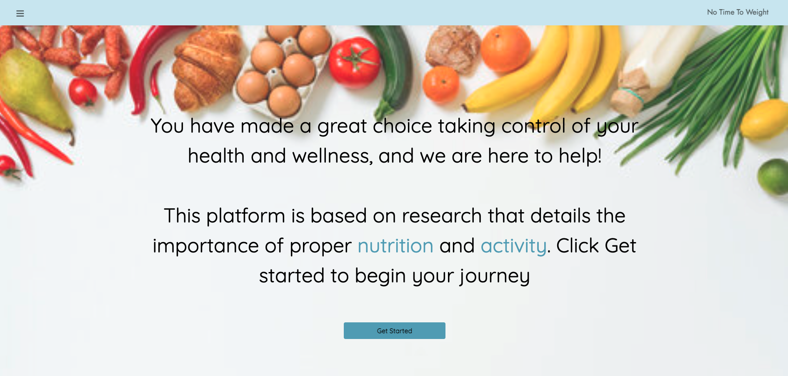
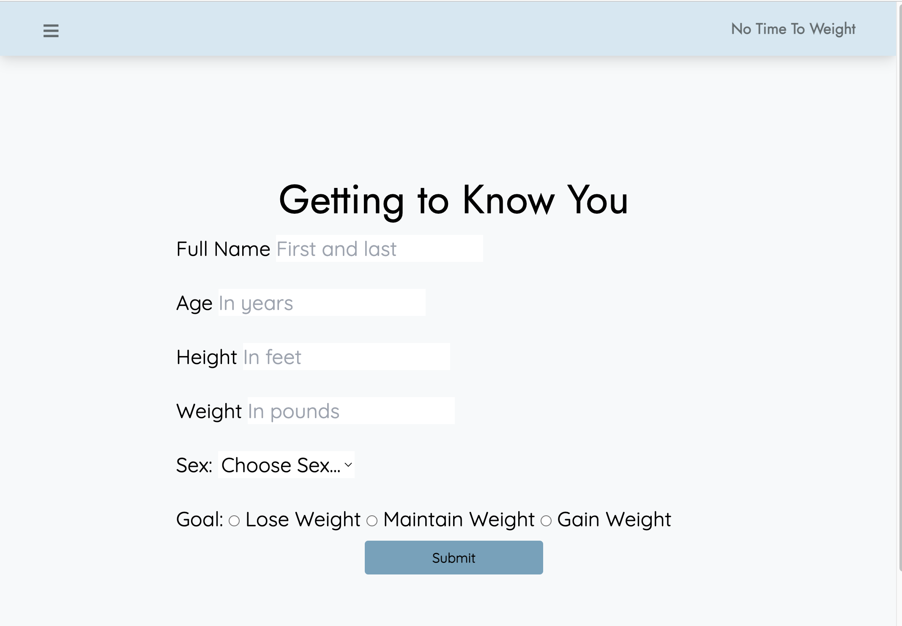
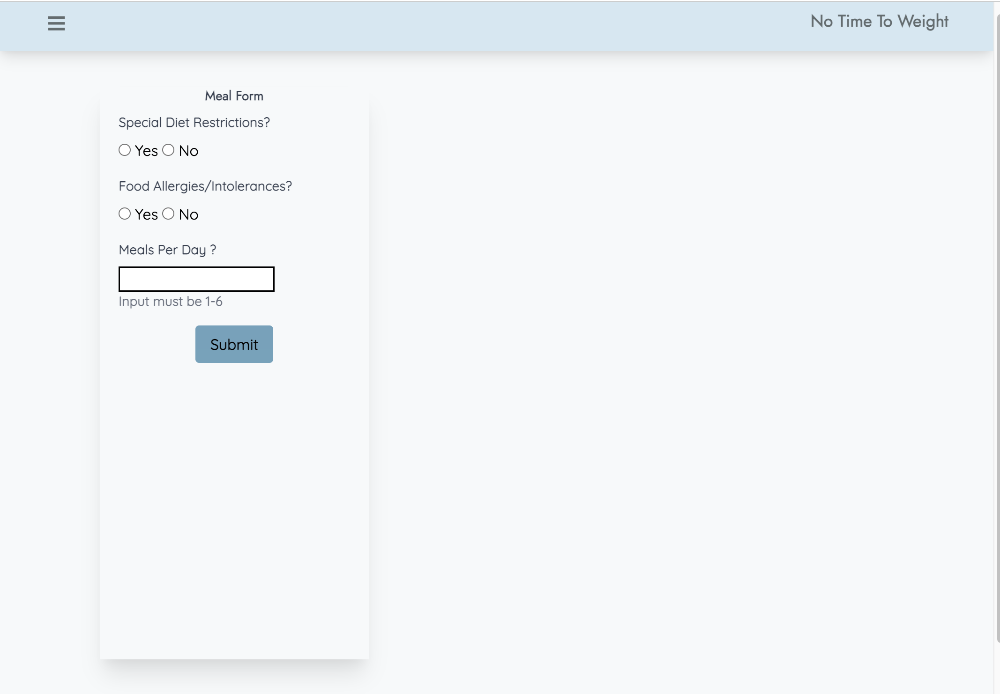
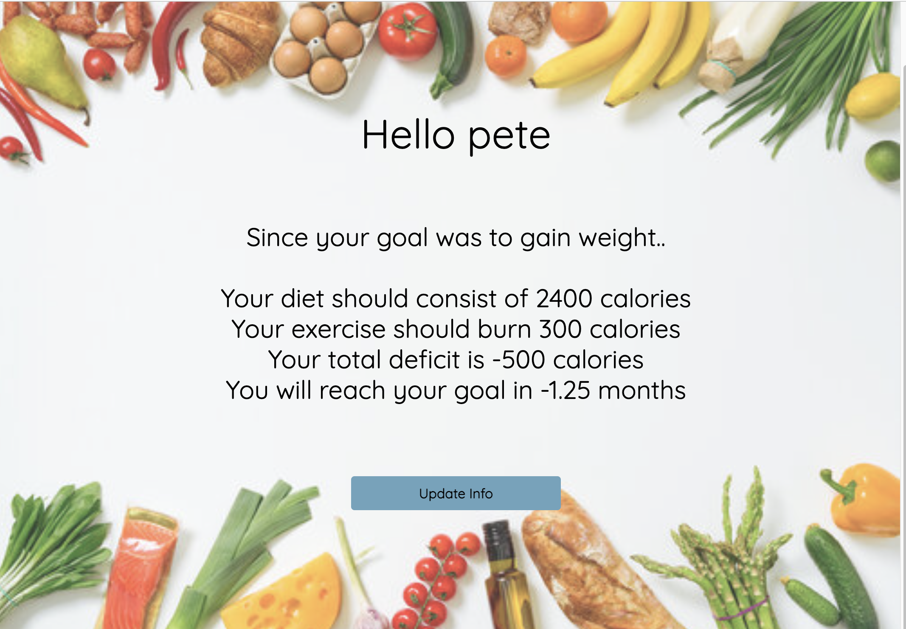

# <No-Time-to-Weight>

## Description of this project
No Time to Weight is a web application that aims to address chronic health and disease burden at the root cause by helping users improve their meal planning and increase their overall activity levels.  Obesity and it's subsequent comorbidities are linked with over 1.5 trillion dollars of healthcare costs annualy.

Not Time to Weight was designed with the intent to allow the user to improve their health, their quality of life, and subsequently reduce overall healthcare burden.  The app will guide the user through a series of questions that will collect individualized data - which will be used create a personal plan to help the user reach their bodyweight goals and recommended daily activity levels.  

## Installation

Utilize this step by step tutorial on how to clone and access the source code provided:
https://docs.github.com/en/repositories/creating-and-managing-repositories/cloning-a-repository


## Usage

1. On the landing page you will be prompted to start your journey
```md

```

2. After clicking on the getting started button you will be prompted to enter some data that will be used to calculate your individualized metabolic rate and help you set goals. 
```md

```

3. Next you will choose from a list of diet restriction and allergies if applicable, as well as how many meals per day you eat.  
```md

```

4 Next you will choose what type of exercise you would like to perform and for what duration to determine how that will impact your overall caloric expenditure. 
```md

```

5. Finally you will reach a summary page where you will get a description of your goal, the calories you should consume and use through exercise to meet your goals and a timeframe that this will happen in.   
```md

```

## Credits
Dalian Grullon
Diego Vargas
Lorenzo Ferri
Pete Wang


## User Story

```
AS AN individula that is concerned about my health and wellness
I WANT to be able to have an app that I can easily find information about my calorie needs and then be able to have suggestions for meals and activities to help me get/stay healthy.
SO THAT I can have have a healthier quality of life with less illness.
```

## Acceptance Criteria

```
GIVEN I am trying to learn how to eat better and be more active.
WHEN I get to the homepage I want to be presented with information on why this is important.
THEN I can click on a button that says Get Started to guide me.
THEN I come to a user form that will ask me information used for meal and activity planning
WHEN I answer the form questions and submit it.
THEN I am taken to a section that will ask if I want to continue or stop for now.
IF I choose to continue I can click the Next Step button which will guide me to a form about my meal preferences.
WHEN I answer the questions and submit it - I will be presented with meals/snack suggestions.
IF I want other suggestions I can click Submit Again for a new list.
IF I like these suggestions I can click Get Your Activity to move on.
WHEN I click Get Your Activity I will have a search box where I can type in activity choices.
THEN I will be presented with my activity and additional suggestions.
IF I am satisfied I can click See Your Results.
THEN I will be presented with a summary of my information.

```

## Technology Used
Spoonacular API:  https://spoonacular.com/food-api
Calorie API: https://api-ninjas.com/api/caloriesburned
CSS framework - Tailwindcss: https://tailwindcss.com/
Javascript, HTML, Jquery 

## Link to Deployed Application
 https://pbnj1.github.io/No-time-to-weight-app/


 